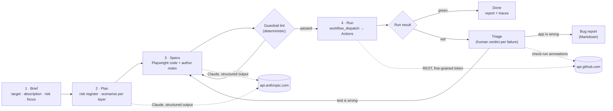

# Design

TestPlan Studio turns a brief about a web application into a risk-based test plan, turns the
browser scenarios of that plan into a Playwright spec, checks the spec against a deterministic
guardrail lint, and runs it on GitHub Actions. It has no backend.

## Flow

Both model calls use the Anthropic TypeScript SDK in the browser with a user-supplied key.
Responses are constrained to a JSON schema (structured outputs) and then re-validated with
business rules the schema cannot express (unique ids, risk references, score ranges, safe file
names). The system prompts are request-independent so they can be prompt-cached.

## Visual design

The interface follows a "printed test protocol" direction designed in Claude Design and
transcribed into plain CSS variables (`src/styles/global.css`): paper ground `#F5F3EC`, ink `#16150F`,
hairline rules, zero radius, Schibsted Grotesk for UI text and JetBrains Mono for ids, scores,
code and section labels. State is carried by two accents only: signal red for errors and high risk,
green for passed and completed. Stamps (rotated, bordered labels) mark provenance and verdicts;
risk scores are 3×3 filled squares rather than coloured pills. Every control keeps a 2px ink focus
ring and the only motion is the 2px progress sweep, which `prefers-reduced-motion` turns static.

## Why a static site

- **Trust boundary is obvious.** The API key and the GitHub token are typed into the page, held in
  memory, and sent only to the two vendor APIs. There is no server that could log them.
- **Hosting is free and reviewable.** GitHub Pages serves the build at studio.ozgurcetintas.dev; GitHub Actions is the runner.
- **Cost stays with the person generating.** Bring-your-own-key means no shared quota to abuse.

The trade-off is that the browser cannot run Playwright itself. That is what the
[`run-generated-spec`](../.github/workflows/run-generated-spec.yml) workflow is for.

## Closing the loop: triage, not healing

A red test is ambiguous. Either the test is wrong, or the application is. A tool that
automatically rewrites the test until it passes will happily erase a real defect, which is the
failure mode ADR-0004 exists to prevent. So the studio stops and asks.

After a failed run it reads the failing tests from the workflow's check-run annotations, which is
the only machine-readable failure detail a browser can reach (artifacts are zipped and job logs
redirect to a host that refuses cross-origin reads). Each failure is shown with its assertion,
locator and code excerpt, and each needs a verdict:

- **The test is wrong** goes back to the model as regeneration feedback, with an explicit
  instruction not to weaken an assertion to make it pass and to say so in the notes if it concludes
  the application is at fault after all.
- **The application is wrong** goes into a Markdown bug report that carries the originating
  scenario, its risks, the reproduction steps and what the runner saw.

Nothing can be acted on while a failure is unreviewed. That is the product expressing the same
position the lab's decision records take: the model proposes, the linter gates, the runner proves,
and the human decides what a failure means.

## Security model

| Concern | Control |
|---|---|
| Reading run results | The fine-grained token needs Actions: read and write to dispatch, and Checks: read to list failing tests. A missing permission is reported as such rather than swallowed. |
| Testing sites you do not own | Targets are an allowlist of practice sites plus the lab app. The UI only offers those ids and the workflow rejects anything else. |
| Arbitrary code execution in Actions | `workflow_dispatch` requires write access to the repository. Fork it to run your own specs. The spec file name is validated with a strict regex; the spec is written only under `runner/generated/`. |
| Keys and tokens | Never persisted, never sent to a third party, never in the URL. The SDK's browser opt-in is used deliberately because each visitor supplies their own key. |
| Prompt injection via the brief | The brief is user-authored and only influences the plan for that user. Output is schema-constrained and re-validated before rendering. |
| Runaway cost | One request per click, `max_tokens` capped, model selectable, progress shown so the user can judge. |

## Layers of verification in this repository

| Layer | What it proves | Where |
|---|---|---|
| Unit | Schema and business-rule validation, guardrail rules, prompt assembly, Markdown export, dispatch client, state transitions | `tests/unit` |
| Component | Form behaviour with Testing Library in jsdom | `tests/unit/BriefForm.test.tsx` |
| Browser E2E | The four-step flow with the Anthropic Messages API mocked at the network layer as server-sent events, so the real SDK parses them; GitHub REST mocked the same way | `tests/e2e` |
| Accessibility | axe-core WCAG A/AA scans on every step | `tests/e2e/accessibility.spec.ts` |
| Contract-style checks | The E2E suite asserts the outbound request shape: model id, cacheable system block, brief content, structured-output format | `tests/e2e/generated-flow.spec.ts` |

What is **not** verified automatically: the quality of a real model response. That is
inherently probabilistic; the sample plan is a hand-written reference, and the guardrail lint is
the deterministic backstop for generated code.

## Phases

1. **Plan** (done): brief → risk register and scenarios, Markdown/JSON export, sample mode.
2. **Specs** (done): scenarios → Playwright spec, guardrail lint, regenerate with feedback.
3. **Run** (done, single runner): dispatch to GitHub Actions, follow the run, link to the report.
4. **Next**: publish the Playwright report to Pages per run; a "diff the plan" view when the brief
   changes; optional OpenAI-compatible provider behind the same `StreamFactory` seam.
